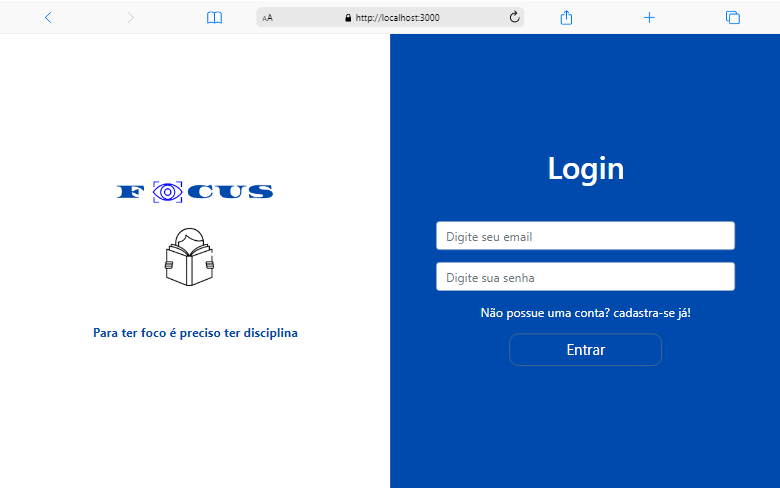

# Focus 3.0

### Bem vindo a versão 3 do meu projeto.
<br>
Para mais detalhes sobre o projeto, verifica as versões anteriores abaixo:

* [Focus2.0](https://github.com/RodrigoVitor/Focus-2.0)
* [Focus1.0](https://github.com/RodrigoVitor/Focus)

<br>

# Novidades da nova versão
 Nas versões anteriores os dados eram armazernado em uma api fake com [json-server](https://www.npmjs.com/package/json-server). Porém essa nova versão os dados serão armazernado em um banco de dado real.

 Nesta nova versão será também implementado a area de login, ou seja o usuário só pode realizar as funcionalidades se estiver autenticado.

 Comparando o codigo atual com as das versões antigas, ele está mais limpo.

 <br>

# Back-end
O desenvolvimento do backend começara em maio, as tecnologia que será utilizada são:
    
    * Nodejs e MongoDB


# Tela Inicial
## Desktop


<br>

## Mobile


<br>
<hr>
<br>


## Build Setup

```bash
# install dependencies
$ yarn install

# serve with hot reload at localhost:3000
$ yarn dev

# build for production and launch server
$ yarn build
$ yarn start

# generate static project
$ yarn generate
```

For detailed explanation on how things work, check out the [documentation](https://nuxtjs.org).

